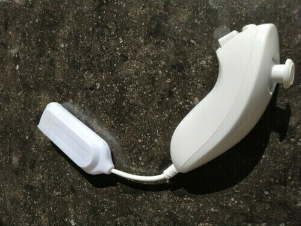
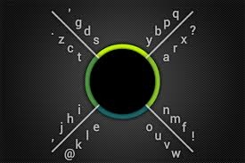
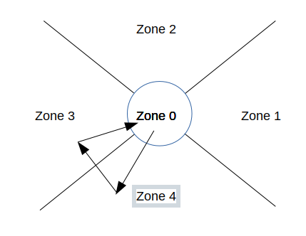
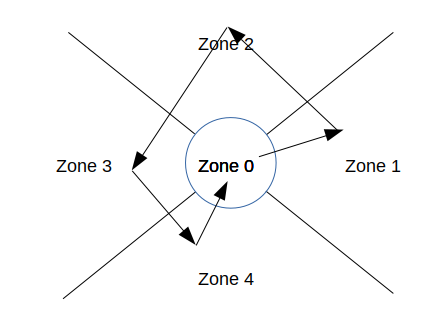
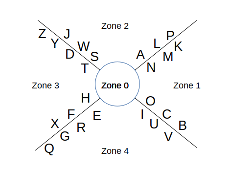
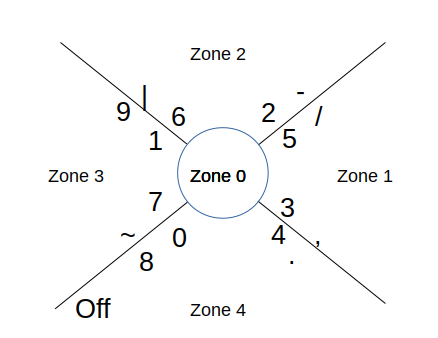
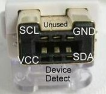
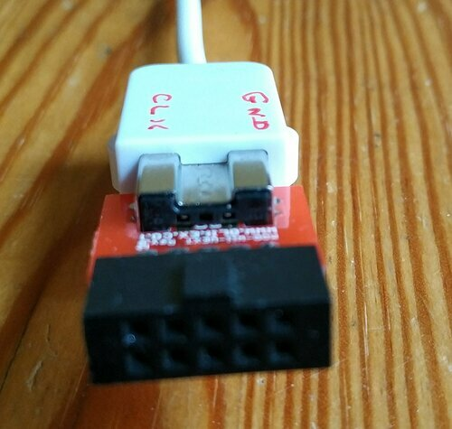
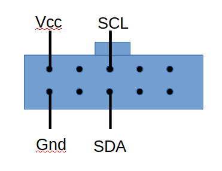
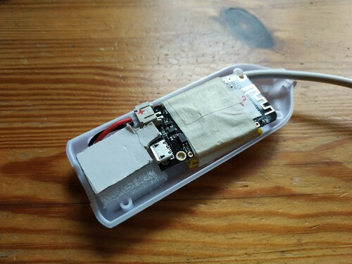

# Nunchuck Based Bluetooth Keyboard for Phones and Tablets 


# Objectives

Provide a single hand, ligthweight, ultra portable and fun bluetooth keyboard for phones and tablets, using a Wii Nunchuck

 

# Original Keys Arrangements - 8Pen Project   

See the links to the 8Pen project at the end of this article, and an description of the concept below (Copied from http://www.8pen.com/concept):

 * To enter a letter, start by placing the finger/pointer in the central region
 * Without lifting, move out in the sector that contains the letter
 * Turn clockwise or anti-clockwise, according to the side on which the letter lies
 * Cross 1 to 4 branches, according to the order of the letter on the boundary, and return to the center to place it

  


# Entering Characters

See the zones identified as zone0 to zone4 below, and the branches separating the zones.    
At rest, the nunchuck is in zone0. If moved to the direction of west, this is zone1. North is zone2 etc.    
The code tracks the position of the nunchuck. and records it in a sequence.    
A sequence starts from zone 0, and ends when back to zone 0.    
When recording the sequence, the starting and ending zones, both are 'zone0' are omitted.    
The longest sequence required to encode a complete keyboard crosses 4 branches in a complete turn. The longest sequence to record is therefore 5 zones long, starting and ending in 
the same zone. 
   
Long sequence example: zone0 - zone4 - zone3 - zone2 - zone1 - zone4 - zone0 :	letter 'q'   

## Entering The Letter 'e'

In the example below, the zone history is zone0 - zone4 - zone3 - zone0. and is encoded as 



```
			case 0x43000:		inKey = 'e';	break;
```

## Entering The Letter 'k'

In this other example, the sequence is zone0 - zone1 - zone2 - zone3 - zone4 - zone 0, and is encoded as 



```
			case 0x12340:		inKey = 'k';	break;
```

## Long Sequence example   

Long sequence example: zone0 - zone4 - zone3 - zone2 - zone1 - zone4 - zone0 :	letter 'q'   
```
			case 0x43214:		inKey = 'q';	break;
```


# Full Keyboard Arrangement


The original letter arrangement of the 8Pen project is not used for this project, the letters are re-organized according to their frequency in the English language.
To the best of my knowledge, this is the alphabet organized by frequency

```
E T A O I N S H R D L C U M W F G Y P B V K J X Q Z
```

## cButton and zButton

There are two buttons on the nunchuck. 
The big square button is the z button, the small round button is the c button.

 * None of these buttons is pressed when entering alphabetic characters. 
 * Pressing z button only (large square button) enters numeric characters and punctuation.
 * Pressing both z and c buttons enters special characters.
 * Pressing c button only is not used at the moment. This mode could be used to enter more characters, or move the mouse with the joystick, similar to joysticks on laptops


## Alphabetic Characters Entry

This is the chosen layout 




Most frequent keys (Enter, Backspace, Space) are entered with a single return to / from zone0 to one of zone4, zone3 or zone1.
Sequence examples


 * A quick trip from zone0 to zone1 and back is a space
 * A quick trip from zone0 to zone3 and back is a backspace
 * A quick trip from zone0 to zone4 and back is an Enter


 * Starting from zone4, turning clockwise, crossing 1 branch is letter  'e'
 * Starting from zone4, turning clockwise, crossing 2 branches is letter  'r'
 * Starting from zone4, turning clockwise, crossing 3 branches is letter  'g'
 * Starting from zone4, turning clockwise, crossing 4 branches is letter  'q'

 * Starting from zone4, turning counter clockwise, crossing 1 branch is letter  'i'
 * Starting from zone4, turning counter clockwise, crossing 2 branches is letter  'u'
 * Starting from zone4, turning clockwise, crossing 3 branches is letter  'v'


## Numeric and Puncutations - zButton pressed

This is the chosen layout 



### Direction keys

 * A quick trip from zone0 to zone1 and back is a RIGHT Arrow
 * A quick trip from zone0 to zone2 and back is an UP Arrow 
 * A quick trip from zone0 to zone3 and back is a LEFT Arrow
 * A quick trip from zone0 to zone4 and back is a DOWN Arrow


### Puntuation and Special Characters:

 * Starting from zone2, turning clockwise, crossing 2 branches prints a hyphen '-'
 * Starting from zone1, turning clockwise, crossing 2 branches prints a comma ','
 
 * Starting from zone4, turning counter clockwise, crossing 2 branches prints a single dot '.'
 * Starting from zone1, turning counter clockwise, crossing 2 branches prints a slash '/'
 * Starting from zone2, turning counter clockwise, crossing 2 branches prints a vertical bar '|'
 * Starting from zone3, turning counter clockwise, crossing 2 branches prints a tilde '~'

 * Starting from zone4, a full turn clockwise is a power off mode (in fact deep sleep)


## Special Actions - zButton AND cButton Pressed 

 * A quick trip from zone0 to zone1 and back is a TAB
 * A quick trip from zone0 to zone3 and back is an ESCAPE


# Learning Required    

Learning is not trivial, but reasonable.    
2 weeks of 20 minutes daily practice should get you started. 
At the time of the original proect, I recommended purchasing 8Pen for android for 99 cents for learning. Not sure if this is still available.

# Limitations    
Multiple keys is not possible. Example Control – C
BUT it is possible to create a special key combinations. Alt Tab is implemented as a single key, as it is very useful for switching between open applications.
This is also how the Application Swith button is implemented on commercial Bluetooth Keyboards (Ex Logitech K380)

# Wiring   

Wires colours will vary across manufacturers, signal position on the connector will not vary. It is necessary to identify the wires by their position, 
and then refer to their colors.


## Front view of the nunchuck connector



In my case, the colour wires were as follows

Signal   | Colour  | Connected to  | Signal Name       
-------------------|---------------|---------------       
SDA      | Yellow  | Arduino SDA   | Data           
DD       | Brown   | Not Connected | Device Detect               
Vcc      | Pink    | Arduino +3.3v | VCC            
Gnd      | Green   | Arduino GND   | GND            
NC       |         | Not Connected | Not Connected               
SCL      | White   | Arduino SCL   | Clock       
       
After carefully identifying the colour of each signal, cut the cable about 5cm from the connector, and connect the wires to the arduino according to the table above. 

Connect the USB mini arduino connector to a USB plug on the computer. The computer provides 5V to the arduino, which in turns provides 3.3 V to the nunchuck. 
This has worked on a wide range of computers, running linux and windows. No current limitation problem noticed


## Olimex Adapter

For quick prototyping, without destroying the original nunchuck by cutting the cable, Olimex makes this nice breakout board

www.olimex.com
MOD-WII-UEXT
MOD-Wii-UEXT-NUNCHUCk







# Assembly

Microcontroller board is a Wemos Lolin32 Lite

The housing of a mini usb hub was a perfect candidate for this.    
The 500maH battery is taped under the board 
Notice the foam used to keep everything in place, and the small lever, making it easier to press the reset button through one of the existing holes





# Arduino Code Structure

Use the I2C Wire Library for communication with nunchuck

Setup function
Initialize Wire library for i2c connections
Keyboard.init
Mouse.init

Loop Function
if cButton is pressed, uses the mouse mode
	Simpy move the mouse in the appropriate direction


if cButton is NOT pressed, uses the keyboard mode

	Read x an y coordinates (0 - 255)
	Convert to center based coordinates (-128 - +127)

	Convert to polar coordinates (Radius, angle)
	Optimisation 
	In fact, does not calculate the angle itself, but only the cosinus of the angle.
	Similarly, does not calculate the radius, but radius * radius

	Radius is used to determine if within the central area
	Cosine of Angle Plus X polararity determines the segment

Logic is simple.
Remains in central area: Do nothing
Outside of central area: Keep record of quadrants visited
Back in central area: Process the sequence of quadrants visited, and send character

ParseSequence Function

Parses the sequence and send the corresponding key to USB
if zbutton is pressed, uses the keypad mode. Otherwise, uses the standard keyboard mode

Extensions of the 8Pen standard
New line, space and back space on single movement ( simple down, right or left)
# Can it be useful ?
Whenever full control in one hand is required
Handicaped, professional activity, presentation
Keyboard can easily be curstomised for a given subset of keys of professional usage (data collection, control)


# Links

1. http://www.8pen.com/concept   
2. https://lifehacker.com/8pen-is-a-speedy-gesture-based-keyboard-for-android-pho-5678488
3. Very good article. Contains a detailled description of the wiring.   
https://create.arduino.cc/projecthub/infusion/using-a-wii-nunchuk-with-arduino-597254
4. Same article, nicer to read 
https://www.xarg.org/2016/12/using-a-wii-nunchuk-with-arduino/
# Document Generation
'''
pandoc -s -o Nunchuck_Ble_Keyboard.pdf  -V geometry:"top=1cm, bottom=1cm, left=1cm, right=1cm" README.md
'''
