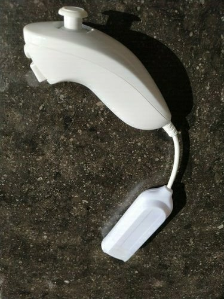

# Nunchuck Based Bluetooth Keyboard for Phones and Tablets 


# Objectives

Provide a single hand, ligthweight ,ultra portable and fun, bluetooth for phones and tablets, using a Wii Nunchuck

 

# Background   

An earlier project (end 2013) was to create a single hand keyboard, more or less complete, alphanumeric keys, punctuation. Original connection was USB only, targeted at computers.
Mouse emulation was added later, as it was an easy extension.

The original idea, using a computer, was “I only have 2 hands. I need both hands for my keyboard. Why the hell was the mouse ever invented ?”
There are 2 solutions to the problem:   
1. Do not use the mouse, dedicate both hands to the keyboard    
2. Find a sngle hand keyboard, and use you free hand for the mouse     

I tried mulitples “single hand keyboard” approaches    
	* learn to use the full keyboard with a single hand (left hand in my case)
	* Find a better layout, half size keyboard, mirrored layout, etc. 

Then came the idea of using a nunchuck as a single hand keyboard.
All of the ideas above work. They require some training, but after about 2 weeks, they can be used. But none of them is efficient.


# Original Keys Arrangements - Inspired from the 8Pen Project   

See links below to the 8Pen project.    

Usage : Copied from http://www.8pen.com/concept

    • To enter a letter, start by placing the finger/pointer in the central region
    • Without lifting, move out in the sector that contains the letter
    • Turn clockwise or anti-clockwise, according to the side on which the letter lies
    • Cross 1 to 4 branches, according to the order of the letter on the boundary, and return to the center to place it

  

# Implementation   

Available only on android. Will never be available on iOS devices

Use the joystick on the nunchuck (not the accelerometers)
Use the buttons for special characters and Mouse emulation

# Limitations    
Multiple keys is not possible. Example Control – C
BUT it is possible to create a special key combinations. Alt Tab is implemented as a single key, as it is very useful for switching between open applications.
This is also how the Application Swith button is implemented on commercial Bluetooth Keyboards (Ex Logitech K380)

# Wiring   

Wires colours will vary across manufacturers, signal position on the connector will not vary. It is necessary to identify the wires by their position, 
and then refer to their colors.


## Front view of the nunchuck connector


In my case, the colour wires were as follows

Signal   | Colour  | Connected to  | Signal Name
-------------------|---------------|---------------
SDA      | Yellow  | Arduino SDA   | Data    
DD       | Brown   | Not Connected | Device Detect        
Vcc      | Pink    | Arduino +3.3v | VCC     
Gnd      | Green   | Arduino GND   | GND     
NC       |         | Not Connected | Not Connected        
SCL      | White   | Arduino SCL   | Clock   
-------------------|---------------|----------------

After carefully identifying the colour of each signal, cut the cable about 5cm from the connector, and connect the wires to the arduino according to the table above. 

Connect the USB mini arduino connector to a USB plug on the computer. The computer provides 5V to the arduino, which in turns provides 3.3 V to the nunchuck. 
This has worked on a wide range of computers, running linux and windows. No current limitation problem noticed


## Olimex Adapter

www.olimex.com
MOD-WII-UEXT
MOD-Wii-UEXT-NUNCHUCk


# Arduino Code Structure

Use the I2C Wire Library for communication with nunchuck

Setup function
Initialize Wire library for i2c connections
Keyboard.init
Mouse.init

Loop Function
if cButton is pressed, uses the mouse mode
	Simpy move the mouse in the appropriate direction


if cButton is NOT pressed, uses the keyboard mode

	Read x an y coordinates (0 - 255)
	Convert to center based coordinates (-128 - +127)

	Convert to polar coordinates (Radius, angle)
	Optimisation 
	In fact, does not calculate the angle itself, but only the cosinus of the angle.
	Similarly, does not calculate the radius, but radius * radius

	Radius is used to determine if within the central area
	Cosine of Angle Plus X polararity determines the segment

Logic is simple.
Remains in central area: Do nothing
Outside of central area: Keep record of quadrants visited
Back in central area: Process the sequence of quadrants visited, and send character

ParseSequence Function

Parses the sequence and send the corresponding key to USB
if zbutton is pressed, uses the keypad mode. Otherwise, uses the standard keyboard mode

Extensions of the 8Pen standard
New line, space and back space on single movement ( simple down, right or left)

# Basic Letter Arrangement

```

Cross 1 zone

					E T A O
					I N S H

Cross 2 zones

					E T A O
					U M W F

Cross 3 zones

					G Y P B
					V K J X

Cross 4 zones

					Q Z

								J	P

								W	L

								S	A
							  /		  \
				Z	Y	D	T			N	M	K

					X 	F	H			O	C	B
							  \		  /
								E	I

								R	U

								G	V

								Q


```
# Zones

'''


						\                       /
						 \       Zone 3        /
						  \                   /
						   \                 /
							\               /
							 \             /
							  \           /
							   \         /								
								+-------+
				Zone 2          | Zone  |		Zone 4
								|   0   |
								+-------+
							   /         \	     							
							  /           \
							 /             \
							/               \
						   /                 \
						  /       Zone 1      \
						 /                     \
						/                       \
						


'''


# Full Keyboard Mapping    

## No Button Pressed 

  Zone            |         |          |
------------------|---------|----------|
 North            |                    |
 South            |     Enter          |
 East             |     Backspace      |
 West             |     Space          |
                  |         |          |
 Crossed zones    |   CW    |    CCW   |
                  |         |         .|
 1 zone crossed   | E T A O | I N S H  |
 2 zones crossed  | R D L C | U M W F  |
 3 zones crossed  | G Y P B | V K J X  |   
 4 zones crossed  | Q Z     |          |   


## zButton Pressed 

  Zone            |         |          |
------------------|---------|----------|
 North            |     UP Arrow       |
 South            |     DOWN Arrow     |
 East             |     Left Arrow     |
 West             |     Right Arrow    |
                  |         |          |
 Crossed zones    |   CW    |    CCW   |
                  |         |         .|
 1 zone crossed   | 0 1 2 3 | 4 5 6 7  |
 2 zones crossed  | 8 9 - , | .        |
 3 zones crossed  |         |          |   
 4 zones crossed  |South-CW4-Power Off |   
------------------|---------|----------|


## zButton AND cButton Pressed 

  Zone            |         |          |
------------------|---------|----------|
 North            |                    |
 South            |                    |
 East             |       Escape       |
 West             |        TAB         |
                  |         |          |
 1 zone crossed   |         |          |
 2 zones crossed  |         |          |
 3 zones crossed  |         |          |   
 4 zones crossed  |                    |   
------------------|---------|----------|


# Learning Required    

Learning is not trivial, but reasonable. 1 to 2 weeks of 20 minutes daily practice should get you started. 
At the time of the original proect, I recommended purchasing 8Pen for android for 99 cents for learning. Not sure if this is still available.

# Can it be useful ?
Whenever full control in one hand is required
Handicaped, professional activity, presentation
Keyboard can easily be curstomised for a given subset of keys of professional usage (data collection, control)


# Links

1. http://www.8pen.com/concept   
2. https://lifehacker.com/8pen-is-a-speedy-gesture-based-keyboard-for-android-pho-5678488
3. Very good article. Contains a detailled description of the wiring.   
https://create.arduino.cc/projecthub/infusion/using-a-wii-nunchuk-with-arduino-597254
4. Same article, nicer to read 
https://www.xarg.org/2016/12/using-a-wii-nunchuk-with-arduino/
# Document Generation
'''
pandoc -s -o Nunchuck_Ble_Keyboard.pdf  -V geometry:"top=1cm, bottom=1cm, left=1cm, right=1cm" README.md
'''
